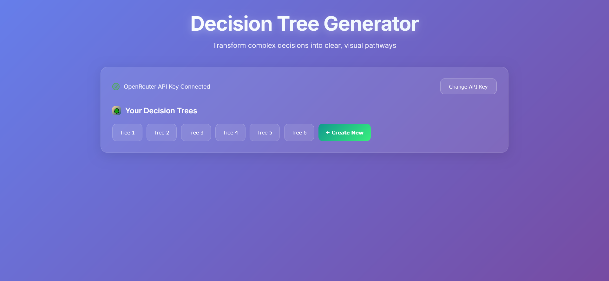
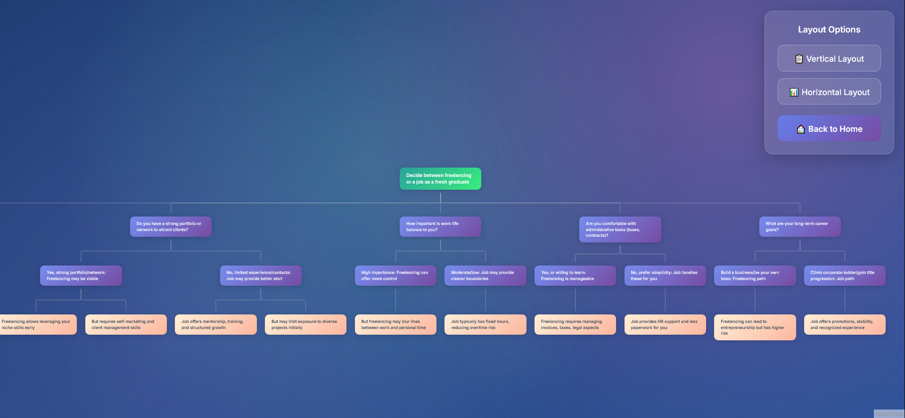

# Decision Tree Generator

Often, I found it useful to analyze situations using decision trees (well, mostly, graphs in my case) to make a decision. Keeping that in mind, I thought to create a simple web-app to create decision trees using LLMs.

Therefore, we present to you our Decision Tree Generator: A simple web application that transforms complex decisions into clear, visual decision trees using AI. Built with React and powered by OpenRouter's AI models.


## ✨ Features

- **AI-Powered Decision Trees**: Generate comprehensive decision trees from natural language descriptions
- **Interactive Visualization**: Beautiful, interactive tree visualization using ReactFlow
- **Multiple Layouts**: Switch between vertical and horizontal tree layouts
- **Tree Management**: Save, load, and manage multiple decision trees
- **Professional UI**: Modern, glass-morphism design with smooth animations
- **Responsive Design**: Works seamlessly on desktop and mobile devices

## � Screenshots

### Main Interface


### Generated Decision Tree Visualization


## �🚀 Getting Started

### Prerequisites

Before you begin, ensure you have the following installed:
- [Node.js](https://nodejs.org/) (version 14.0 or higher)
- [npm](https://www.npmjs.com/) (comes with Node.js)
- An [OpenRouter API key](https://openrouter.ai/) for AI functionality (it's free)

### Installation

1. **Clone the repository**
   ```bash
   git clone https://github.com/dev-M-Ali/Decision-Tree-Generator.git
   cd Decision-Tree-Generator/decision-tree-generator
   ```

2. **Install dependencies**
   ```bash
   npm install
   ```

3. **Start the development server**
   ```bash
   npm start
   ```

4. **Open your browser**
   Navigate to [http://localhost:3000](http://localhost:3000) to view the application.

## 🛠️ Built With

- **React** - Frontend framework
- **ReactFlow** - Interactive node-based UI
- **Dagre** - Graph layout algorithm
- **Axios** - HTTP client for API requests
- **OpenRouter API** - AI-powered decision tree generation

